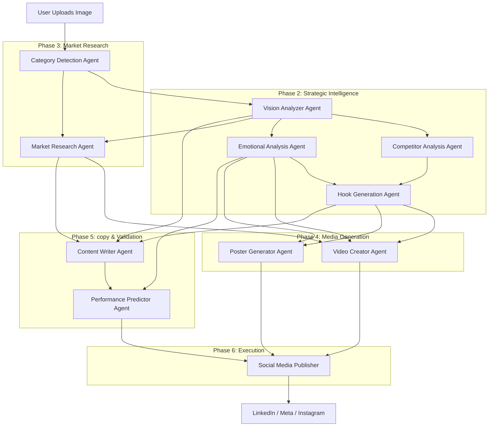

# Catalyst AI Workflow Diagram

## Agent Roles
1. **Category Detection**: Classifies product into 7 marketing categories.
2. **Vision Analyzer**: GPT-4o analysis of visual features, materials, and colors.
3. **Competitor Analysis**: Visual comparison with market leaders.
4. **Emotional Analysis**: Maps product features to psychological triggers.
5. **Hook Generation**: Creates viral hooks (curiosity, problem-agitation).
6. **Market Research**: Brave Search for reviews and customer sentiment.
7. **Video Creator**: Generates script and 10s video (Sora-2).
8. **Poster Generator**: DALL-E 3 high-spec ad poster.
9. **Content Writer**: Generates platform-specific text (LinkedIn, Blog, Meta).
10. **Performance Predictor**: Estimates engagement scores.
11. **Publisher**: Handles API posting to social platforms.
